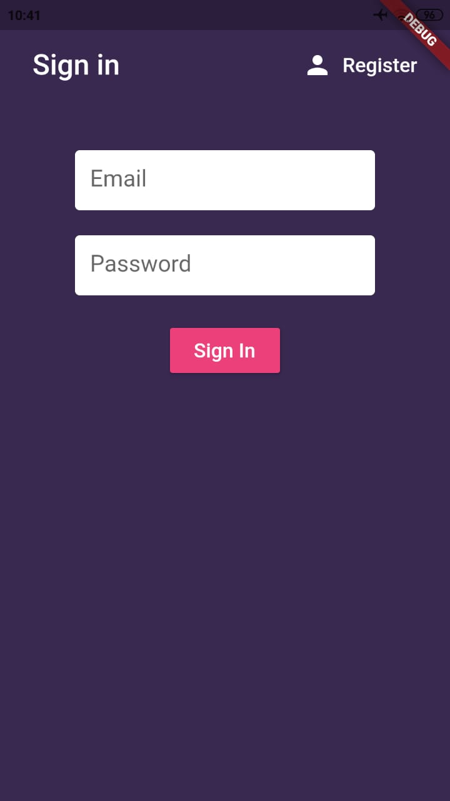
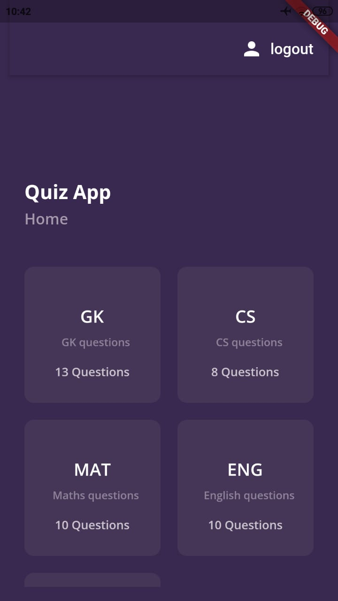
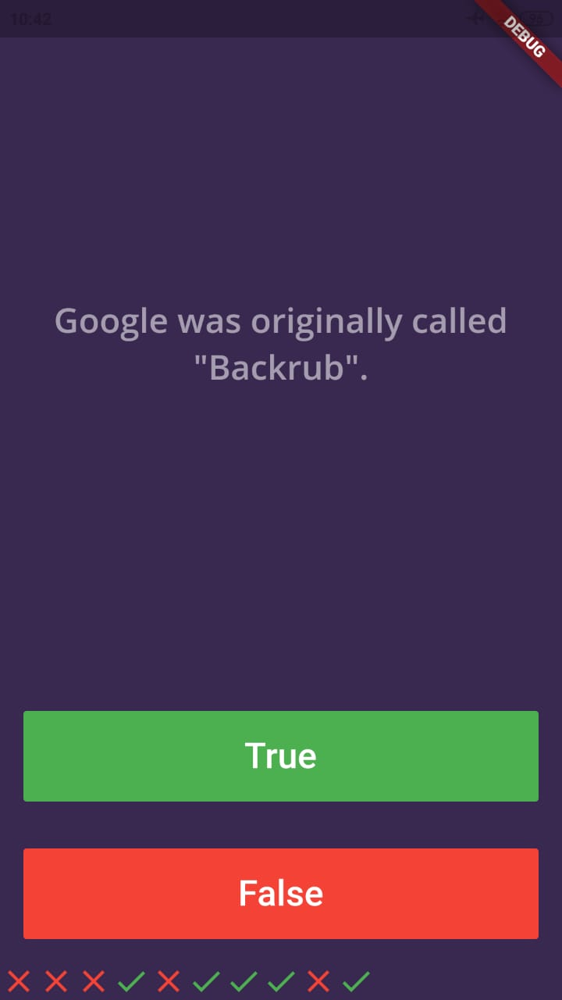
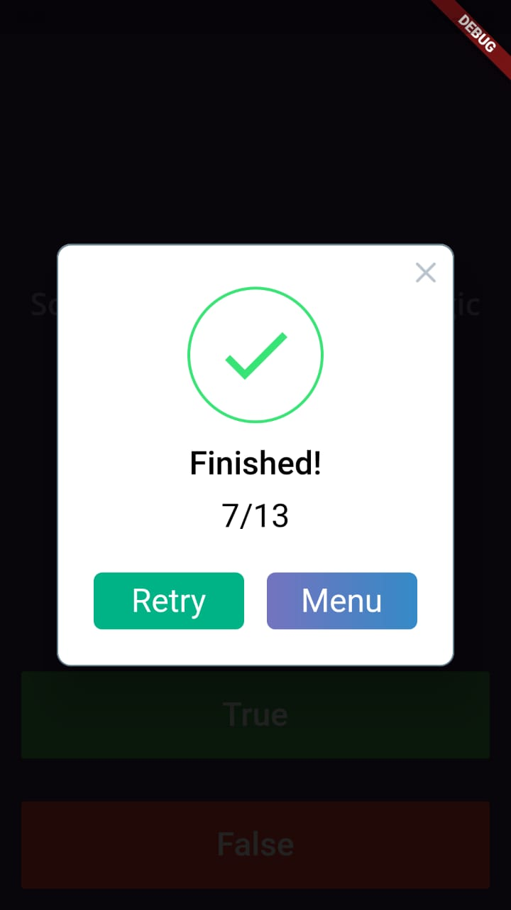
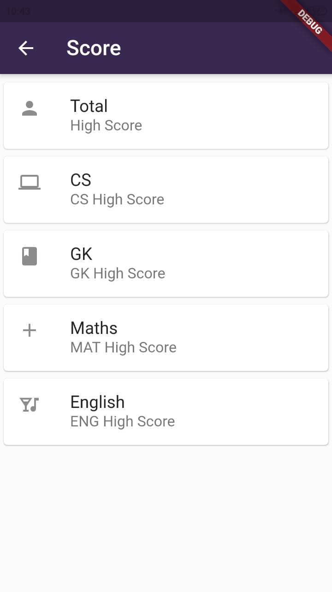
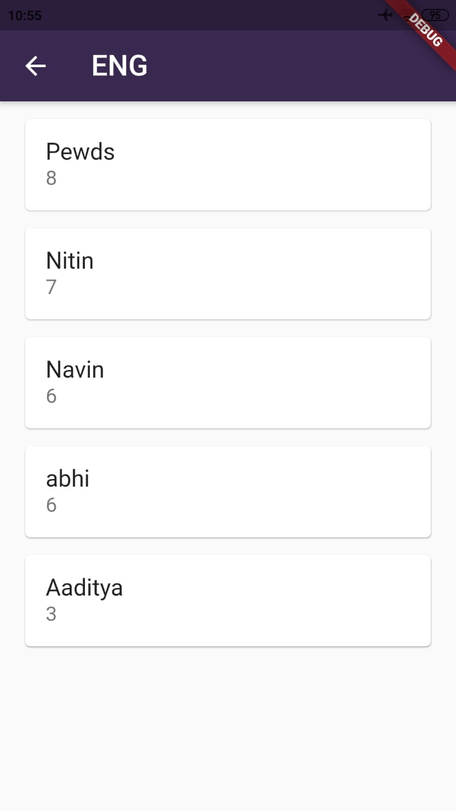
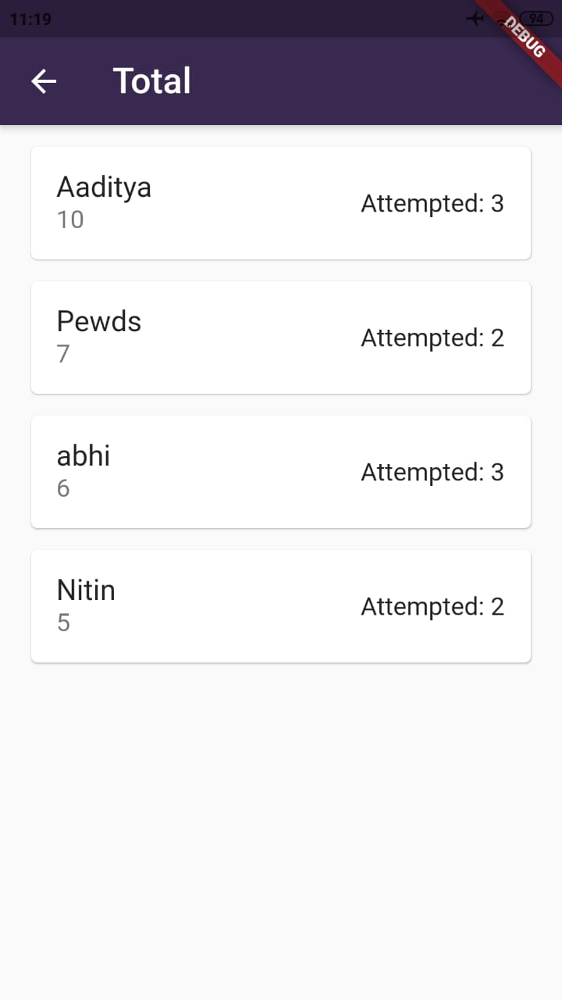

# Qriosity

A quiz app made with flutter.
* Built on top of --> [Quizzler](https://github.com/londonappbrewery/quizzler-flutter)

## Features:
- [x] SignUp, SignIn and SignOut
- [x] Quizzes available for different topics 
- [x] User cannot exit a quiz once it gets started
- [x] Answers are shown at the bottom of the screen after attempting
- [x] After the quiz is over, the score is shown where the user can either give the quiz again or go back to the menu
- [x] User can see own best score in different categories.
- [x] Different Categories
- [x] Multiple Users
- [x] Result Page
## Scores feature
- [x] Users can attempt the quiz of any topic multiple amounts of times but the first score is only recorded for each topic
- [x] Recorded scores can be seen in the rank list with other users who have given the quiz
- [x] Ranklist is available for each topic as well as for overall collective scores of every topic attempted
- [x] Scores are shown in descending order with the name
- [x]  Firebase is used to store marks of each topic with user names
- [x] Each name of users are unique as name is taken from their email ids
- [x]  Total high scores are also shown for all users with the number of topics attempted 

# Images:
SignIn Screen | Home Page | GK Quiz 
:-------------------------:|:-------------------------:|:-------------------------:|
   |  |  |  

After attempting quiz | LeaderBoard | English LeaderBoard 
:-------------------------:|:-------------------------:|:-------------------------:|
   |    |    

Total users LeaderBoard | 
:-------------------------:|
 |

# Links:

* [Video Link](https://youtu.be/MLvR5IKvHxs)

